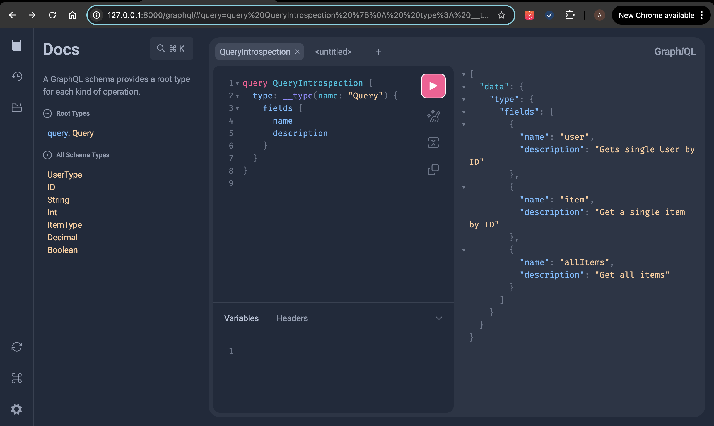
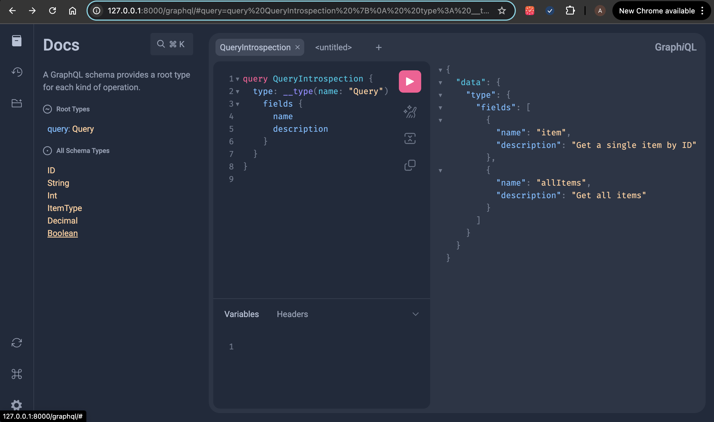
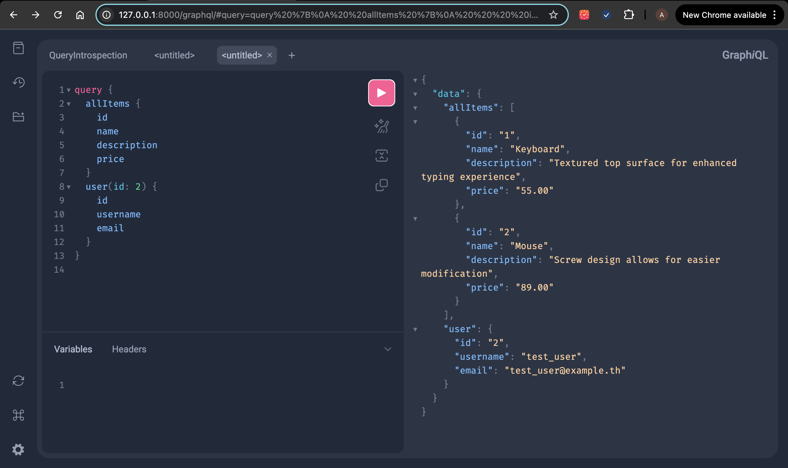
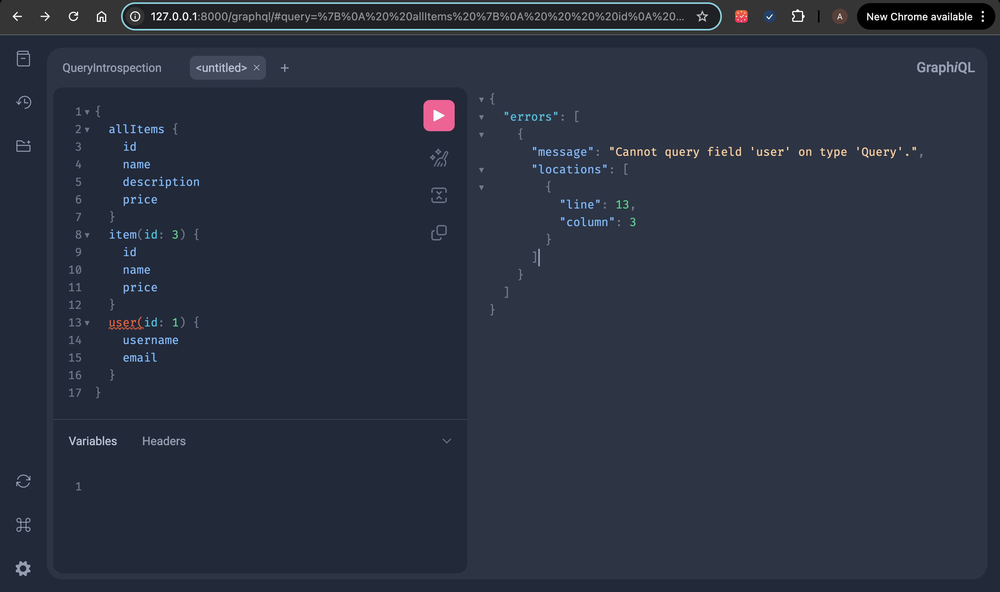

# Django GraphQL API with Field Visibility Control

This project is a Django-based GraphQL API that implements user-based field visibility using Graphene-Django. 
It restricts certain fields (like the `user` field) based on user permissions.

## Features

- A GraphQL API that allows querying **items** and **users**.
- Restricts access to the `user` field based on the `auth.view_user` permission.
- Fully tested using Django's `TestCase` and Graphene's `Client`.

## Prerequisites

- Python 3.10
- Django 5.1.1
- Graphene-Django 3.2.2


## Installation

1. **Clone the repository**:
```bash
git clone https://github.com/trueSnevar/adbro_test.git
cd adbro_test
```

2. **Set up a virtual environment (optional but recommended):**

```bash
python3 -m venv venv
source venv/bin/activate
```

3. **Install dependencies:**

```bash
pip install -r requirements.txt
```

4. **Set up the database: Run the migrations to set up the SQLite database:**
```bash
python manage.py migrate
```

5. **Create a superuser: You can create a superuser to access the Django admin and assign permissions:**

```bash
python manage.py createsuperuser
```

6. **Run the development server:**

```bash
python manage.py runserver
```

# GraphQL API Endpoints
The GraphQL API is accessible at the following URL:

GraphQL Explorer: http://localhost:8000/graphql/
You can use the GraphiQL interface to run queries, mutations, and view the schema documentation.

## Sample GraphQL Queries
1. **Get all items:**

```graphql
{
  allItems {
    id
    name
    description
    price
  }
}
```

2. **Get a single item by ID:**

```graphql
{
  item(id: 1) {
    name
    description
    price
  }
}
```

3. **Get a user by ID (Requires auth.view_user permission):**

```graphql
{
  user(id: 1) {
    username
    email
  }
}
```

## Restricting Access to the user Field
The user field can only be accessed by users with the auth.view_user permission. If a user without this permission tries to query the user field, they will receive an error message:

```json
{
  "errors": [
    {
      "message": "Cannot query field 'user' on type 'Query'.",
      "locations": [
        {
          "line": 3,
          "column": 3
        }
      ]
    }
  ]
}
```

## Running Tests
The project includes a suite of unit tests to verify the functionality of the GraphQL API and permission controls.

1. **To run the tests, use the following command:**

```bash
python manage.py test
```

2. **The tests cover:**

 - Querying items and users

 - Access control for the user field based on permissions

# Proof of work

Introspecting schema for users with permissions


Introspecting schema for users without permissions


Making a query for users with permissions


Making a query for users without permissions
